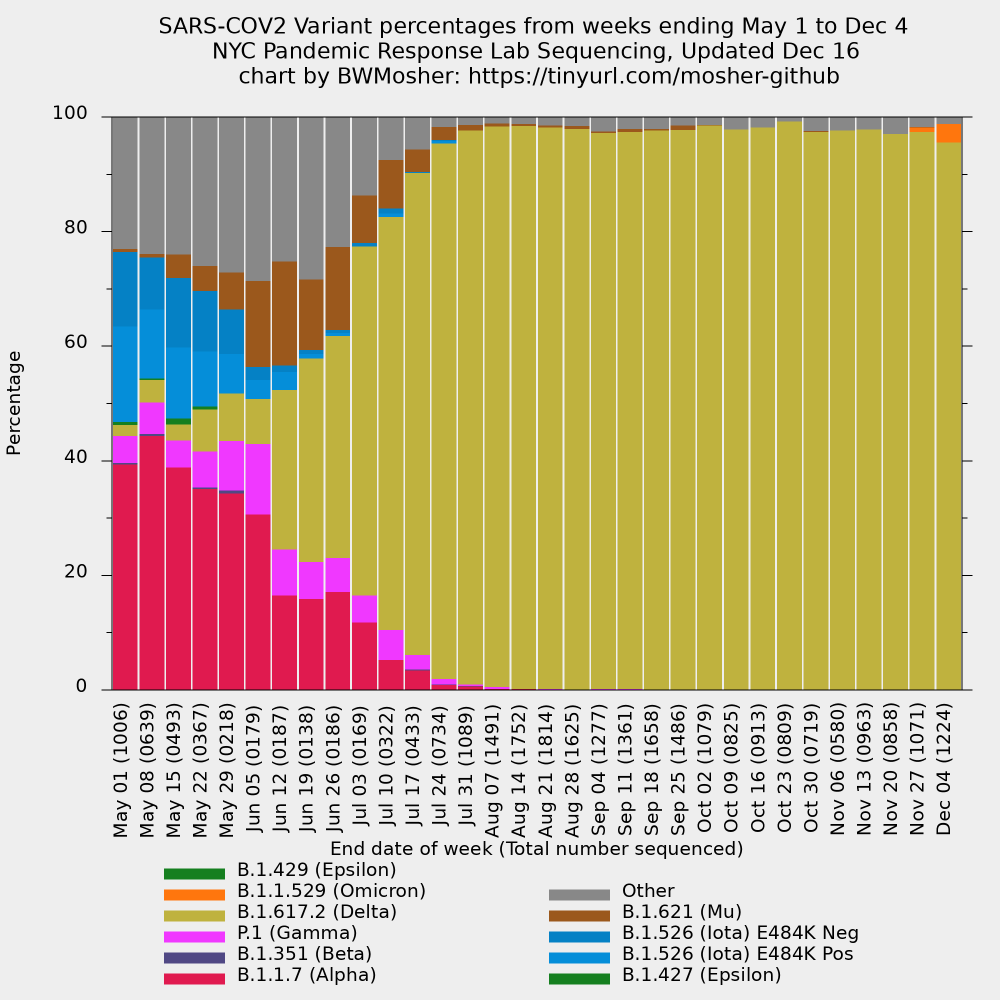
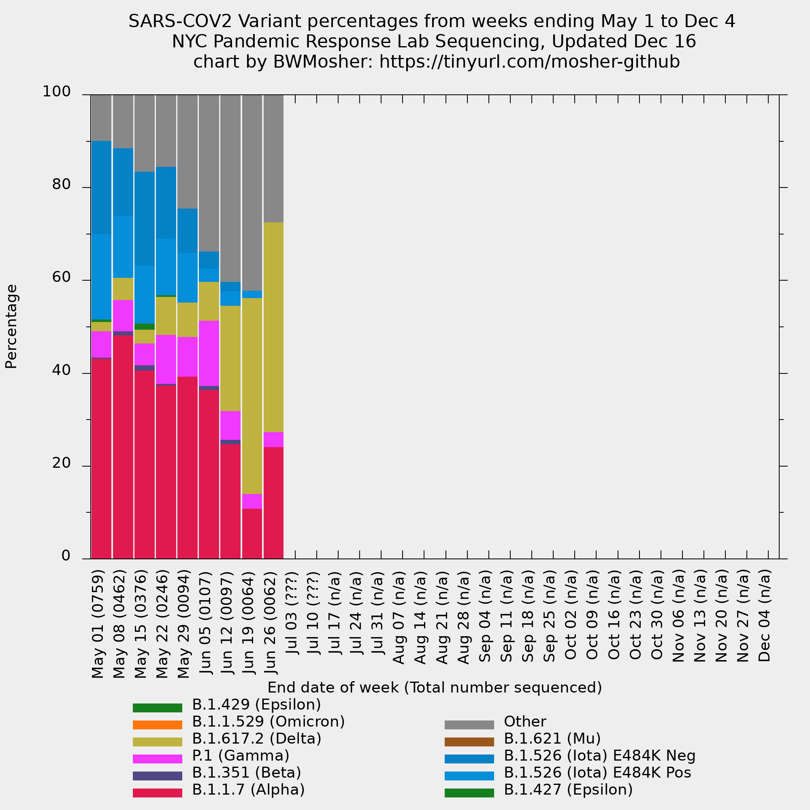
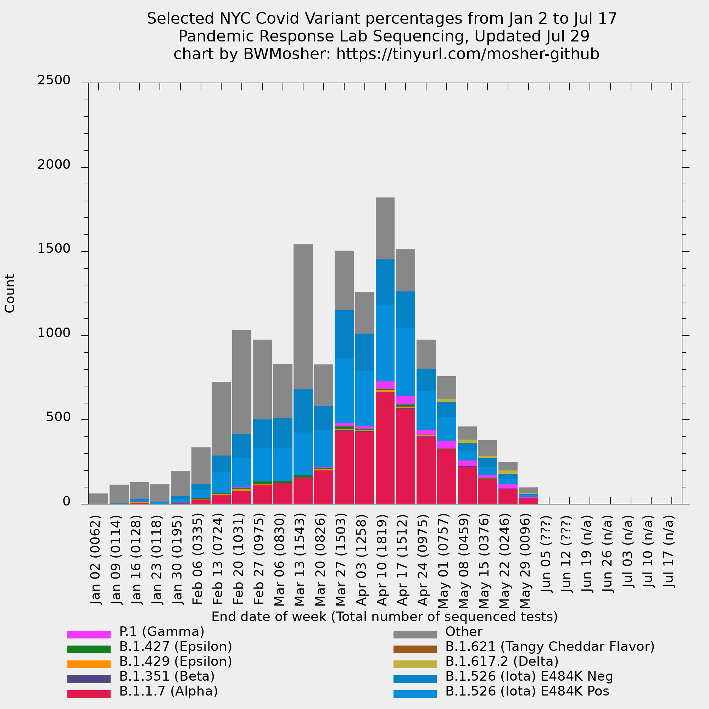

# Welcome to my folder of NYC Covid graphs

## What is in this repo

- There's a human-readable version of `../variant-epi-data-readable.csv` for each week since 2021-06-10 in `../history`
	- It has the dates and total count sequenced (from `../cases-sequenced.csv`)
- This folder called `visualization/` contains plotting stuff, plots, gifs
	- They're not updated weekly anymore, it's a few times a year now.
	- `visualization/YYYY-MM-DD.p` plots all strains given in the data for the week ending on that date
		- This is gnuplot code. [How to install gnuplot](https://www.google.com/search?q=gnuplot+installation+directions).
		- It plots the strains in a stacked histogram.
		- `visualization/YYYY-MM-DD.png` is the resulting image.
		- Download it to view it or scroll down.
	<!-- - `../visualization/four-weeks-plotted.p` makes a graph that highlights the four last weeks of data that the city is just lumping together on their public display. -->
	<!-- - `visualization/ignored-strains.p` is a graph that uses the data before they eliminated strains that are not very prevalent. -->
	<!-- 	- This graph will not be updated because there is no data to update it with. -->
	<!-- 	- Note the top of the graph reaches 10% and this is not the same as other graphs you might see from me. -->
<!-- - The folder below, `visualization/spoofs` contains my simulations of what the -->
  <!-- city display would look like if it were using a one week window instead of -->
  <!-- a four week window. **I haven't been updating this.** -->

## Images (updated 2021-12-16)

### The all strains graph from May to the 2021-12-16 report

`2021-12-16.png`

### The all strains graph animated from 2021-07-03 to 2021-12-16

Slower speed

Faster speed

Fastest speed

<!-- ### The all strains graph animated for the last seven weeks, using counts. -->

<!--  -->

<!-- ### The last four weeks graph -->

<!-- `four-weeks-plotted.png` -->

<!--  -->

<!-- ### The selected variants from only the last week -->

<!-- `last-1-week.png` -->

<!--  -->

<!-- ### The strains excluded from the data from June 10th (that we were previously monitoring) -->

<!-- `disregarded-variants-through-may23.png` -->

<!--  -->

Do you have feedback or a visualization request? Open an issue.
