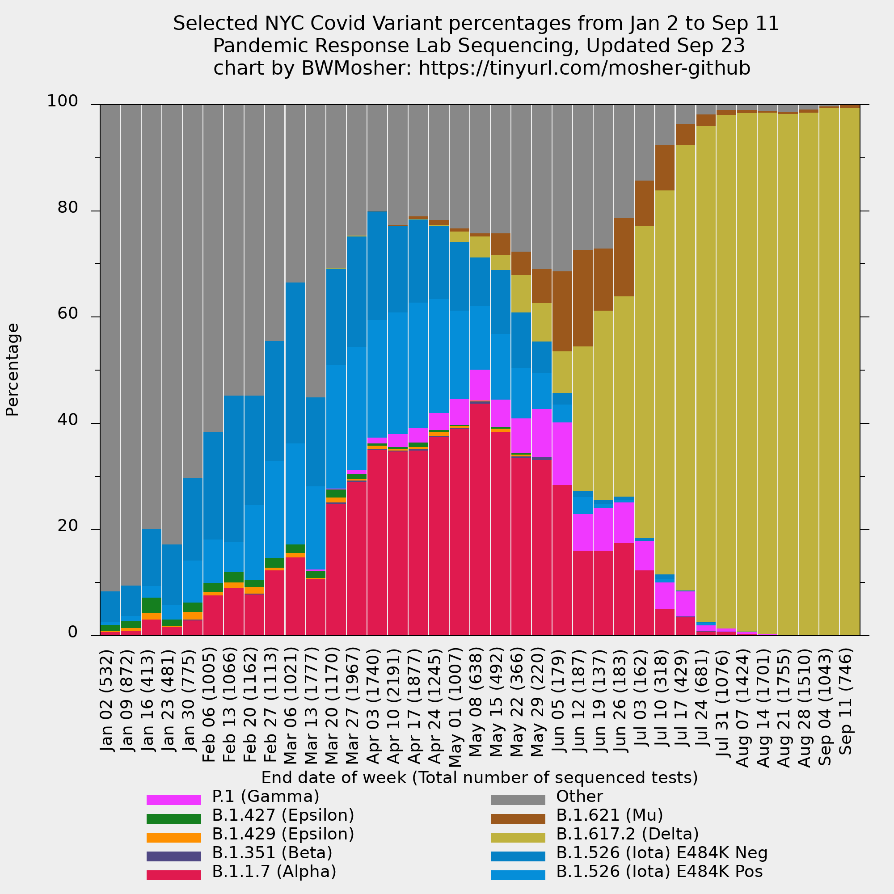

# Welcome to my folder

- There's a human-readable data file called `../variant-epi-data-readable.csv`
	- It has the dates and percentages sequenced (from `../cases-sequenced.csv`)
	- I didn't do anything else to it, data the same as the city.
- This folder called `visualization/` contains my files
	- `visualization/all-weeks-plotted.p` is gnuplot code. [How to install gnuplot](https://www.google.com/search?q=gnuplot+installation+directions).
		- it plots the strains in a stacked histogram.
		- `visualization/all-weeks-plotted.png` is the resulting image.
		- Download it to view it or scroll down.
		- Do you have feedback or a visualization request? Open an issue or tweet me **@BWMosher**.
	- `visualization/ignored-strains.p` is a graph that uses the data before they eliminated strains that are not very prevalent.
		- This graph will not be updated because there is no data to update it with.
		- Note the top of the graph reaches 10% and this is not the same as other graphs you might see from me.
- There are also visualizations of the data in the style of the variant report that the city puts out [here](https://tinyurl.com/choose-your-window). Change this cell *after making a copy because you don't have edit access* to change the averaging window of the graphic.

## images

### the all strains graph from the data from June 10th

`all-weeks-plotted.png`

### the strains excluded from the data from June 10th (that we were previously monitoring)

`disregarded-variants-through-may23.png`

