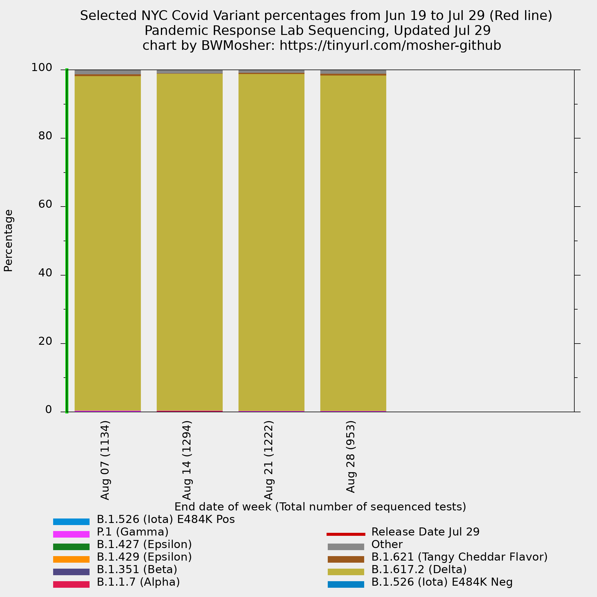
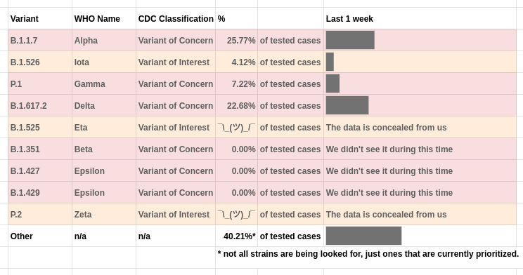

# Welcome to my folder of NYC Covid graphs

## What is in this folder

- There's a human-readable data file called `../variant-epi-data-readable.csv`
	- It has the dates and total count sequenced (from `../cases-sequenced.csv`)
	- I made the dates given use month abbreviations and I added two rows for the weeks that are yet to happen.
- This folder called `visualization/` contains my files
	- `visualization/all-weeks-plotted.p` plots all strains given in `../variant-epi-data-readable.csv`
		- This is gnuplot code. [How to install gnuplot](https://www.google.com/search?q=gnuplot+installation+directions).
		- It plots the strains in a stacked histogram.
		- `visualization/all-weeks-plotted.png` is the resulting image.
		- Download it to view it or scroll down.
	- `../visualization/four-weeks-plotted.p` makes a graph that highlights the four last weeks of data that the city is just lumping together on their public display.
	- `visualization/ignored-strains.p` is a graph that uses the data before they eliminated strains that are not very prevalent.
		- This graph will not be updated because there is no data to update it with.
		- Note the top of the graph reaches 10% and this is not the same as other graphs you might see from me.
- The folder below, `visualization/spoofs` contains my simulations of what the
  city display would look like if it were using a one week window instead of
  a four week window. **I haven't been updating this.**

## Images (updated 2021-07-25)

### The all strains graph from January 2nd to Today

`all-weeks-plotted.png`

### The all strains graph animated for the last five weeks.

Notice the changes

### The last four weeks graph

`four-weeks-plotted.png`

<!-- ### The selected variants from only the last week -->

<!-- `last-1-week.png` -->

<!--  -->

### The strains excluded from the data from June 10th (that we were previously monitoring)

`disregarded-variants-through-may23.png`

Do you have feedback or a visualization request? Open an issue or tweet me **@BWMosher**.
