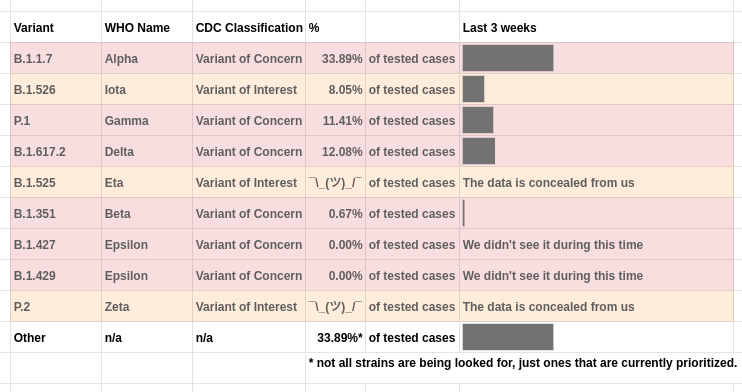

# What's going on here?

## note, this hasn't been updated since 2021-06-24

- The city has a visualization of the data at [this website](https://www1.nyc.gov/site/doh/covid/covid-19-data-variants.page). It averages the  *last 4 weeks together*.
- I think this is a bad idea so I have remade the graphic. You can choose the window that the graphic averages over.
- These graphics are screenshots of a spreadsheet linked [here](https://tinyurl.com/choose-your-window). Change the linked cell *after making a copy because you don't have edit access* to change the averaging window of the graphic.
- I'm not sure how to make the creation of these graphics live in GitHub instead of in a spreadsheet but this works for now and it matches the data. I included an extra digit of precision and you can see that this number rounds to the city number when the four-week window is active.

## Images (note: old)

## An average of the last 4 weeks

 
## An average of the last 3 weeks

 
## An average of the last 2 weeks

 
## A display of the last 1 week

